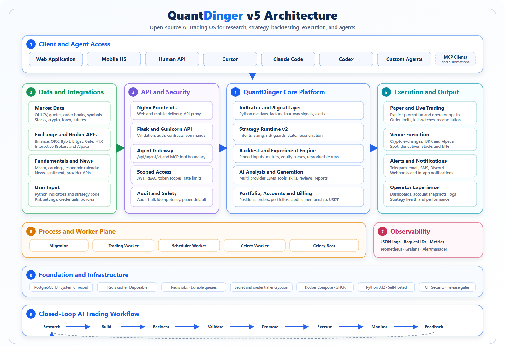
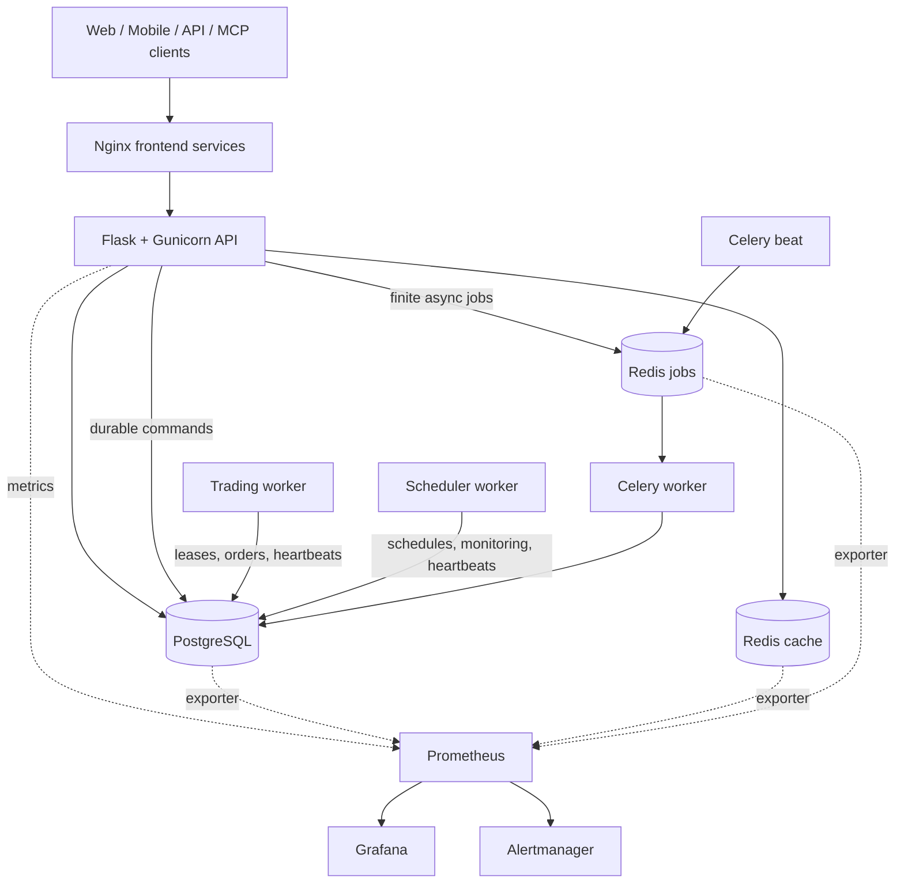

<div align="center">
  <a href="https://github.com/brokermr810/QuantDinger">
    
  </a>

  <h1>QuantDinger</h1>
  <p><strong>Open-source AI Trading OS</strong></p>
  <p>Turn trading ideas into Python strategies, backtests, paper trading, live execution, and monitoring — all in one self-hosted stack.</p>
  <p><strong>QuantDinger is a product of Open Byte Inc.</strong></p>
  <p><em>AI research → Strategy code → Backtest → Paper/Live execution → Monitoring</em></p>

  <p>
    <a href="README.md"><strong>English</strong></a>
    ·
    <a href="docs/README_CN.md"><strong>简体中文</strong></a>
    ·
    <a href="docs/api/README.md"><strong>API</strong></a>
    ·
    <a href="docs/agent/README.md"><strong>AI Agents & MCP</strong></a>
  </p>

  <p>
    <a href="https://ai.quantdinger.com"><strong>Live App</strong></a>
    ·
    <a href="https://www.quantdinger.com"><strong>Website</strong></a>
    ·
    <a href="https://www.youtube.com/watch?v=tNAZ9uMiUUw"><strong>Video Demo</strong></a>
    ·
    <a href="mailto:support@quantdinger.com"><strong>Official Support Email</strong></a>
  </p>

  <p>
    <a href="https://t.me/quantdinger"></a>
    <a href="https://discord.com/invite/tyx5B6TChr"></a>
    <a href="https://youtube.com/@quantdinger"></a>
    <a href="https://x.com/QuantDinger_EN"></a>
  </p>

  <p>
    <a href="LICENSE"></a>
    
    
    
    
    
  </p>
</div>

> QuantDinger can submit real orders when live trading is explicitly enabled.
> Start with paper trading, use restricted API keys, and review the risk and
> compliance requirements for your jurisdiction. This project does not provide
> investment advice.

## What QuantDinger is

QuantDinger is an **open-source AI Trading OS** for independent traders, Python
strategy authors, and small teams. Its local-first, self-hosted design keeps
market data, strategy code, broker credentials, and deployment under the
operator's control.

The project combines:

- multi-provider AI market research and analysis;
- Python indicators and Strategy API V2 development;
- server-side backtesting and experiment workflows;
- paper and live execution across crypto exchanges and traditional brokers;
- web, mobile H5, human API, Agent Gateway, and MCP access;
- PostgreSQL-backed state, durable workers, audit logs, and optional monitoring.

It is not a black-box signal service. Strategy code, risk settings, credentials,
and deployment remain under the operator's control.

## What changed in v5

The v5 backend is organized around explicit runtime and operational boundaries:

- the HTTP API no longer owns long-running trading or scheduler loops;
- trading, scheduling, Celery jobs, and migrations run as separate processes;
- Celery handles finite, retryable work while long-lived strategy runtimes stay
  in the trading worker;
- cache Redis and durable job Redis use separate instances and eviction policies;
- high-risk API contracts are represented in OpenAPI and protected by tests;
- JSON logs, request IDs, Prometheus metrics, dashboards, and alert rules are
  available through an optional observability overlay;
- the production overlay runs backend processes as a non-root user with a
  read-only root filesystem, dropped capabilities, and resource limits;
- CI checks syntax, lint, tests, release gates, Compose files, dependencies,
  source security, secrets, API compatibility, version drift, and text encoding.

The source version is declared in [`VERSION`](VERSION). Git release tags use the
same semantic version with a leading `v`, for example `v5.0.1`.

## Architecture

<p align="center">
  
</p>

<p align="center"><sub>The editable source is available as <a href="docs/screenshots/architecture-v5.svg">architecture-v5.svg</a>.</sub></p>

The diagram above shows the complete product and process architecture. The
runtime topology below focuses on container-to-container ownership and data flow.



One backend image is reused by several containers with different commands:

| Process | Responsibility |
| --- | --- |
| `migration` | Applies the database schema and exits before application services start. |
| `backend` | Handles HTTP, authentication, validation, and durable command submission. |
| `trading-worker` | Owns strategy runtimes, pending orders, broker sessions, and reconciliation. |
| `scheduler-worker` | Runs portfolio, deployment, payment, and signal schedules. |
| `celery-worker` | Executes finite AI, backtest, experiment, report, and maintenance jobs. |
| `celery-beat` | Dispatches periodic Celery tasks. |

See [Backend process roles](docs/architecture/PROCESS_ROLES_AND_TASKS.md),
[architecture](docs/architecture/ARCHITECTURE.md), and
[concurrency model](docs/architecture/CONCURRENCY_MODEL.md) for the ownership rules.

## Quick start

### Option A: prebuilt images

Prerequisites: Docker with Compose v2. Node.js and a local Python environment are
not required.

Linux or macOS:

```bash
curl -fsSL https://raw.githubusercontent.com/brokermr810/QuantDinger/main/install.sh | bash
```

Windows PowerShell:

```powershell
irm https://raw.githubusercontent.com/brokermr810/QuantDinger/main/install.ps1 | iex
```

The installer asks for the initial administrator credentials, generates the
required secrets, downloads the GHCR Compose stack, and starts it.

Open:

- Web: <http://127.0.0.1:8888>
- Mobile H5: <http://127.0.0.1:8889>
- API health: <http://127.0.0.1:5000/api/health>

### Option B: source checkout

```bash
git clone https://github.com/brokermr810/QuantDinger.git
cd QuantDinger
cp backend_api_python/env.example backend_api_python/.env
cp .env.example .env
```

Before the first start, replace the example values in both environment files:

| File | Required production values |
| --- | --- |
| `backend_api_python/.env` | `SECRET_KEY`, `CREDENTIAL_ENCRYPTION_KEY`, `ADMIN_USER`, `ADMIN_PASSWORD` |
| `.env` | `POSTGRES_PASSWORD`, `REDIS_PASSWORD`, `CELERY_REDIS_PASSWORD`, `GRAFANA_ADMIN_PASSWORD` |

Generate independent secrets with:

```bash
python -c "import secrets; print(secrets.token_hex(32))"
```

Start the core stack from local backend source:

```bash
docker compose up -d --build
docker compose ps
```

The base stack does not start Prometheus, Grafana, or Alertmanager. This keeps
the default open-source installation smaller.

For detailed installation paths, Windows notes, China mirror settings, and
PostgreSQL migration guidance, see
[Installation troubleshooting](docs/deployment/INSTALL_TROUBLESHOOTING.md) and the
[cloud deployment guide](docs/deployment/CLOUD_DEPLOYMENT_EN.md).

## Production deployment

Validate secrets before starting a production stack:

```bash
python backend_api_python/scripts/check_production_config.py \
  --env-file .env \
  --env-file backend_api_python/.env
```

Start the hardened runtime with optional observability:

```bash
docker compose \
  -f docker-compose.yml \
  -f docker-compose.production.yml \
  -f docker-compose.observability.yml \
  up -d --build
```

Omit `docker-compose.observability.yml` when the host is resource-constrained or
monitoring is provided externally.

Production rules:

- expose only a TLS reverse proxy on ports 80/443;
- keep PostgreSQL, both Redis instances, Prometheus, Grafana, and Alertmanager
  off the public internet;
- do not deploy with example passwords or empty encryption keys;
- back up PostgreSQL and the durable `redis-jobs` volume;
- keep cache Redis disposable and never use it as the Celery broker;
- review worker health and application readiness after every deployment.

The full checklist is in [Production hardening](docs/deployment/PRODUCTION_HARDENING.md).

## Local endpoints

All published ports bind to loopback by default.

| Service | Default URL | Purpose |
| --- | --- | --- |
| Web | <http://127.0.0.1:8888> | Desktop web client and same-origin API proxy. |
| Mobile H5 | <http://127.0.0.1:8889> | Mobile web client and same-origin API proxy. |
| Backend | <http://127.0.0.1:5000> | Direct API access and health endpoints. |
| Grafana | <http://127.0.0.1:3000> | Dashboards; available only with the observability overlay. |
| Prometheus | <http://127.0.0.1:9090> | Metrics storage and queries; optional. |
| Alertmanager | <http://127.0.0.1:9093> | Alert grouping, silencing, and delivery; optional. |

Container-only ports such as the job Redis and exporters are not published to
the host.

## Observability

The monitoring stack is optional by design:

- **Prometheus** collects API, worker, PostgreSQL, and Redis metrics.
- **Grafana** turns those metrics into operator dashboards.
- **Alertmanager** groups alerts, manages silences, and sends notifications once
  a receiver is configured.

Start it for local diagnostics without the production overlay:

```bash
docker compose \
  -f docker-compose.yml \
  -f docker-compose.observability.yml \
  up -d
```

Monitoring services stay on `127.0.0.1`. Use a VPN, SSH tunnel, or authenticated
reverse proxy for remote administration. See
[Observability](docs/deployment/OBSERVABILITY.md) for dashboards, alerts, retention, and
receiver configuration.

## Security model

- Broker credentials and MFA secrets are encrypted with a stable
  `CREDENTIAL_ENCRYPTION_KEY`.
- Agent tokens are hashed, scoped, rate-limited, and audit-logged.
- Agent trading is paper-only by default; live access requires both token and
  server-side authorization.
- Long-running strategy ownership uses leases, heartbeats, and fencing tokens.
- Production containers run without root privileges or Linux capabilities.
- Host port defaults are loopback-only; public access should terminate at a TLS
  reverse proxy.

Report vulnerabilities privately according to [SECURITY.md](SECURITY.md). Do
not include credentials, account data, or exploitable details in public issues.

## Strategy and integration surfaces

| Area | Current surface |
| --- | --- |
| Indicators | Python chart overlays, markers, bands, and signals. |
| Strategies | Strategy API V2 intents, sizing, risk, backtests, and live runtime. |
| Crypto | Binance, OKX, Bitget, Bybit, Gate, HTX, Coinbase Exchange, Kraken, and adapter extensions. |
| Traditional brokers | IBKR and Alpaca workflows. |
| AI providers | OpenRouter, OpenAI-compatible APIs, Google, DeepSeek, Grok, MiniMax, and custom endpoints. |
| Automation | Human API, Agent Gateway, MCP server, Celery jobs, schedules, and notifications. |

Start with the [Indicator guide](docs/trading/INDICATOR_DEV_GUIDE.md),
[Strategy guide](docs/trading/STRATEGY_DEV_GUIDE.md), and
[Extension guide](docs/architecture/EXTENSION_GUIDE.md).

## AI agents and MCP

The Agent Gateway is exposed under `/api/agent/v1`. The included MCP server lets
clients such as Cursor, Claude Code, and Codex call approved tools without
receiving broker credentials or administrator JWTs.

Live trading through an agent requires all of the following:

1. a token with trading scope;
2. `paper_only=false` on that token;
3. `AGENT_LIVE_TRADING_ENABLED=true` on the server;
4. operator-configured limits and allowlists.

See [MCP setup](docs/agent/MCP_SETUP.md),
[Agent quick start](docs/agent/AGENT_QUICKSTART.md), and the
[Agent OpenAPI document](docs/agent/agent-openapi.json).

## Development

Backend development uses Python 3.12:

```bash
cd backend_api_python
python -m venv .venv
python -m pip install -r requirements-dev.txt
python -m pytest -m "not integration and not stress" --ignore=tests/release_gate -q
ruff check app scripts tests
```

Useful repository checks:

```bash
python scripts/check_version.py
python scripts/check_mojibake.py
docker compose -f docker-compose.yml config -q
docker compose -f docker-compose.yml -f docker-compose.production.yml -f docker-compose.observability.yml config -q
```

API changes should follow [API conventions](docs/architecture/API_CONVENTIONS.md), update the
OpenAPI artifact when required, and pass the compatibility workflow.

## Repository layout

This repository contains the backend, worker processes, deployment definitions,
operations configuration, documentation, and MCP server. The desktop and mobile
client source code live in separate repositories; this repository consumes their
published images in the Compose stacks.

```text
QuantDinger/
|-- .github/workflows/                 CI, security, compatibility, and release checks
|-- backend_api_python/                Backend application and all backend processes
|   |-- app/
|   |   |-- __init__.py                Flask application factory and core wiring
|   |   |-- startup.py                 Process-aware startup hooks and service singletons
|   |   |-- celery_app.py              Celery application and task registration
|   |   |-- commands/                  Migration, scheduler, trading, and health entrypoints
|   |   |-- config/                    Environment-backed database, Redis, and provider config
|   |   |-- routes/                    Human HTTP API route facades
|   |   |   `-- agent_v1/              Scoped Agent Gateway API under /api/agent/v1
|   |   |-- openapi/                   OpenAPI schemas, tags, registration, and export support
|   |   |-- services/                  Domain workflows and third-party integrations
|   |   |   |-- backtest_engine/       Backtest execution components
|   |   |   |-- live_trading/          Normalized crypto exchange adapters
|   |   |   |-- alpaca_trading/        Alpaca broker integration
|   |   |   |-- ibkr_trading/          Interactive Brokers integration
|   |   |   |-- strategy_runtime/      Strategy signals, intents, execution, and state
|   |   |   `-- strategy_v2/           Versioned strategy contracts and runtime services
|   |   |-- data_sources/              Raw market-data source adapters
|   |   |-- data_providers/            Aggregated market, macro, news, and sentiment providers
|   |   |-- markets/                   Market and symbol normalization
|   |   |-- tasks/                     Finite, retryable Celery jobs
|   |   |-- workers/                   Long-lived worker process shells
|   |   |-- runtime/                   Process-role and ownership helpers
|   |   |-- observability/             Request context, metrics, and HTTP instrumentation
|   |   `-- utils/                     Shared low-level database, cache, auth, and logging helpers
|   |-- migrations/                    PostgreSQL schema and seed migrations
|   |-- scripts/                       Backend maintenance and validation commands
|   |-- tests/                         Unit, contract, integration, and release-gate tests
|   |-- run.py                         Local Flask and Gunicorn application entrypoint
|   |-- Dockerfile                     Shared image for API and worker containers
|   `-- docker-entrypoint.sh           Container command dispatcher
|-- docs/
|   |-- architecture/                  Boundaries, concurrency, API, and extension design
|   |-- deployment/                    Installation, production, and observability operations
|   |-- trading/                       Strategy and indicator development guides
|   |-- api/                           Human API documentation
|   `-- agent/                         Agent Gateway and MCP documentation
|-- mcp_server/                        Standalone QuantDinger MCP server package
|   |-- src/quantdinger_mcp/           MCP server and security implementation
|   `-- tests/                         MCP contract and security tests
|-- ops/                               Runtime operations configuration
|   |-- prometheus/                    Scrape configuration and alert rules
|   |-- grafana/                       Provisioned data sources and dashboards
|   `-- alertmanager/                  Alert routing configuration
|-- scripts/                           Repository-level version, encoding, and setup checks
|-- docker-compose.yml                 Core local/source stack
|-- docker-compose.ghcr.yml            Prebuilt-image installation stack
|-- docker-compose.production.yml      Production hardening overlay
|-- docker-compose.observability.yml   Optional monitoring overlay
|-- install.sh / install.ps1           Linux/macOS and Windows installers
`-- VERSION                            Canonical source version
```

### Main execution paths

| Flow | Path through the repository |
| --- | --- |
| Synchronous API request | `app/routes` -> `app/services` -> database, cache, market-data, or trading adapter |
| Durable strategy command | API route -> PostgreSQL command record -> `trading-worker` -> strategy runtime and broker adapter |
| Finite background job | API or Celery beat -> job Redis -> `app/tasks` in `celery-worker` -> PostgreSQL result |
| Scheduled domain work | `app/commands/scheduler.py` -> scheduling services -> durable state and notifications |
| Monitoring | API and workers -> `app/observability` metrics -> Prometheus -> Grafana and Alertmanager |
| Agent or MCP call | MCP client -> `mcp_server` -> `/api/agent/v1` -> the same service layer used by human APIs |

Long-lived trading loops belong to the trading worker. Finite, retryable work
belongs to Celery. HTTP routes validate and delegate; they must not own trading
loops, exchange-specific behavior, or large database workflows.

### Where changes belong

| Change | Primary location | Usually update as well |
| --- | --- | --- |
| Add or modify an HTTP endpoint | `backend_api_python/app/routes/` | `app/openapi/`, route/contract tests, API docs |
| Add a business workflow | `backend_api_python/app/services/` | focused service tests |
| Add an exchange or broker integration | `app/services/live_trading/` or the broker package | credential policy, adapter tests, docs |
| Add a market-data source | `app/data_sources/` | provider aggregation, cache keys, tests |
| Add dashboard, news, or macro aggregation | `app/data_providers/` | route facade and cache policy |
| Add a finite asynchronous task | `app/tasks/` | `celery_app.py`, queue routing, task tests |
| Add long-lived process behavior | `app/workers/`, `app/commands/`, or `app/runtime/` | Compose command, health checks, ownership tests |
| Change the database schema | `backend_api_python/migrations/` | migration/release-gate tests and docs |
| Add metrics or alerts | `app/observability/` and `ops/` | dashboard, alert rule, observability docs |
| Add an MCP tool | `mcp_server/src/quantdinger_mcp/` | Agent Gateway scope, security tests, agent docs |

The web and mobile repositories publish their own GHCR images. Node.js is only
needed when building those clients from source. For deeper ownership rules, read
[Architecture](docs/architecture/ARCHITECTURE.md),
[Module boundaries](docs/architecture/MODULE_BOUNDARIES.md), and
[Process roles](docs/architecture/PROCESS_ROLES_AND_TASKS.md).

## Documentation

The maintained documentation index is available at [`docs/README.md`](docs/README.md).

| Topic | Document |
| --- | --- |
| Contributor architecture | [Architecture](docs/architecture/ARCHITECTURE.md) |
| Module ownership | [Module boundaries](docs/architecture/MODULE_BOUNDARIES.md) |
| Process and task ownership | [Process roles](docs/architecture/PROCESS_ROLES_AND_TASKS.md) |
| Production runtime | [Production hardening](docs/deployment/PRODUCTION_HARDENING.md) |
| Metrics and alerts | [Observability](docs/deployment/OBSERVABILITY.md) |
| Human API contracts | [API conventions](docs/architecture/API_CONVENTIONS.md) |
| OpenAPI artifacts | [API documentation](docs/api/README.md) |
| Strategy development | [Strategy guide](docs/trading/STRATEGY_DEV_GUIDE.md) |
| Indicator development | [Indicator guide](docs/trading/INDICATOR_DEV_GUIDE.md) |
| MCP and agents | [Agent documentation](docs/agent/README.md) |
| Cloud deployment | [Cloud deployment](docs/deployment/CLOUD_DEPLOYMENT_EN.md) |
| Installation problems | [Troubleshooting](docs/deployment/INSTALL_TROUBLESHOOTING.md) |

## Contributing

Read [CONTRIBUTING.md](CONTRIBUTING.md) and [DEVELOPMENT.md](DEVELOPMENT.md)
before opening a pull request. Keep routes thin, preserve API compatibility,
place long-running behavior in the correct process, and include focused tests
for high-risk changes.

## Exchange partner links

These are referral links. QuantDinger may receive a commission or trading-fee
rebate when a user registers through one of them. This does not add a separate
charge to the user; eligibility and terms are controlled by each venue and may
change. Always verify the destination domain before creating an account.

The same links are available in the application under **Profile → Open account**
and **Broker Accounts → Open account**.

| Exchange | Signup link |
| --- | --- |
| Binance | [Register](https://www.bsmkweb.cc/register?ref=QUANTDINGER) |
| Bitget | [Register](https://partner.hdmune.cn/bg/7r4xz8kd) |
| Bybit | [Register](https://partner.bybit.com/b/DINGER) |
| OKX | [Register](https://www.xqmnobxky.com/join/QUANTDINGER) |
| Gate.io | [Register](https://www.gateport.business/share/DINGER) |
| HTX | [Register](https://www.htx.com/invite/zh-cn/1f?invite_code=dinger) |

## License and commercial terms

- Backend source code is licensed under [Apache License 2.0](LICENSE).
- QuantDinger is a product of **Open Byte Inc**. The name, logo, product
  identity, and commercial licensing are managed separately from the code license.
- Web frontend source is published in
  [QuantDinger Frontend](https://github.com/brokermr810/QuantDinger-Vue) under
  its own source-available license.
- Mobile H5 and native client source is published in
  [QuantDinger Mobile](https://github.com/brokermr810/QuantDinger-Mobile) under
  its own source-available license.
- Trademark, branding, attribution, and watermark use is governed by
  [TRADEMARKS.md](TRADEMARKS.md). Apache 2.0 does not grant trademark rights.

For commercial licensing, frontend source access, branding authorization, or
deployment support:

- Website: [quantdinger.com](https://www.quantdinger.com)
- Telegram: [t.me/worldinbroker](https://t.me/worldinbroker)
- Email: [support@quantdinger.com](mailto:support@quantdinger.com)

## Legal notice and compliance

QuantDinger is intended for **lawful research, education, and compliant trading
only**. It must not be used for fraud, market manipulation, sanctions evasion,
money laundering, or other illegal activity. Operators are responsible for
following the laws, licensing requirements, tax rules, broker or exchange terms,
and data regulations that apply in every jurisdiction where they deploy or use
the software.

**This project does not provide legal, tax, investment, financial, or regulatory
advice.** Trading, including automated and leveraged trading, can result in the
loss of some or all capital. Historical data, backtests, simulated results, AI
output, indicators, and strategy examples do not guarantee future performance.
Users must independently review strategies, permissions, order limits, and risk
controls before enabling live execution.

The software is provided under the terms of the applicable license and is used
at the operator's own risk. To the extent permitted by law, project maintainers
and contributors disclaim liability for trading losses, data loss, service
interruption, third-party failures, security incidents, or regulatory consequences
arising from use or misuse of the software.

## Community and support

<p>
  <a href="https://t.me/quantdinger"></a>
  <a href="https://discord.com/invite/tyx5B6TChr"></a>
  <a href="https://youtube.com/@quantdinger"></a>
  <a href="https://x.com/QuantDinger_EN"></a>
</p>

- [Website](https://www.quantdinger.com)
- [Contributing guide](CONTRIBUTING.md)
- [Contributors](CONTRIBUTORS.md)
- [Report bugs or request features](https://github.com/brokermr810/QuantDinger/issues)
- Email: [support@quantdinger.com](mailto:support@quantdinger.com)

## Support the project

If QuantDinger is useful to you, a GitHub star, contribution, or donation helps
fund ongoing development and infrastructure.

Crypto donation address:

```text
0x96fa4962181bea077f8c7240efe46afbe73641a7
```

Crypto transfers are irreversible. Confirm the address and intended network with
the project maintainers before sending funds.

## Star history

[](https://star-history.com/#brokermr810/QuantDinger&Date)

## Acknowledgements

QuantDinger stands on top of a strong open-source ecosystem. Special thanks to
the maintainers and contributors of projects including:

- [Flask](https://flask.palletsprojects.com/)
- [Gunicorn](https://gunicorn.org/)
- [Celery](https://docs.celeryq.dev/)
- [PostgreSQL](https://www.postgresql.org/)
- [Redis](https://redis.io/)
- [Pandas](https://pandas.pydata.org/)
- [NumPy](https://numpy.org/)
- [CCXT](https://github.com/ccxt/ccxt)
- [yfinance](https://github.com/ranaroussi/yfinance)
- [AkShare](https://github.com/akfamily/akshare)
- [Vue.js](https://vuejs.org/)
- [Ant Design Vue](https://antdv.com/)
- [KLineCharts](https://github.com/klinecharts/KLineChart)
- [ECharts](https://echarts.apache.org/)
- [Capacitor](https://capacitorjs.com/)
- [bip-utils](https://github.com/ebellocchia/bip_utils)
- [Prometheus](https://prometheus.io/)
- [Grafana](https://grafana.com/)

## P.S. — A note on the name

**QuantDinger** is a small tribute to
**[Erwin Schrödinger](https://en.wikipedia.org/wiki/Erwin_Schr%C3%B6dinger)** —
the “-dinger” in our name is the tail of “Schrödinger”. The cat in the box was a
thought experiment; every un-fired strategy is its own little version of it —
simultaneously winning and losing until the order actually fills. Backtests open
the box. Live trading collapses the wavefunction. Trade carefully.

<p align="center"><sub>If QuantDinger is useful to you, a GitHub star helps the project a lot.</sub></p>
