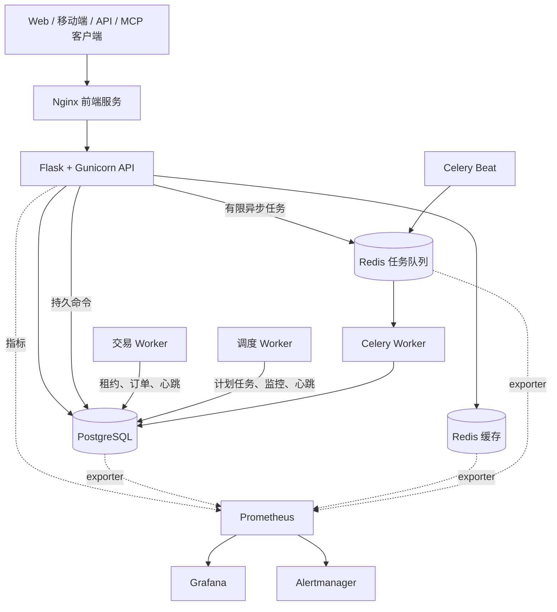

<div align="center">
  <a href="https://github.com/brokermr810/QuantDinger">
    
  </a>

  <h1>QuantDinger</h1>
  <p><strong>开源AI自动化交易系统</strong></p>
  <p>将交易想法转化为 Python 策略、回测、模拟盘、实盘执行和监控——全部运行在一套可自托管系统中。</p>
  <p><strong>QuantDinger 是 Open Byte Inc 的产品。</strong></p>
  <p><em>AI 研究 → 策略代码 → 回测 → 模拟盘/实盘执行 → 监控</em></p>

  <p>
    <a href="../README.md"><strong>English</strong></a>
    ·
    <a href="README_CN.md"><strong>简体中文</strong></a>
    ·
    <a href="api/README.md"><strong>API</strong></a>
    ·
    <a href="agent/README.md"><strong>AI Agent 与 MCP</strong></a>
  </p>

  <p>
    <a href="https://ai.quantdinger.com"><strong>在线应用</strong></a>
    ·
    <a href="https://www.quantdinger.com"><strong>官方网站</strong></a>
    ·
    <a href="https://www.youtube.com/watch?v=tNAZ9uMiUUw"><strong>视频演示</strong></a>
    ·
    <a href="mailto:support@quantdinger.com"><strong>官方支持邮箱</strong></a>
  </p>

  <p>
    <a href="https://t.me/quantdinger"></a>
    <a href="https://discord.com/invite/tyx5B6TChr"></a>
    <a href="https://youtube.com/@quantdinger"></a>
    <a href="https://x.com/QuantDinger_EN"></a>
  </p>

  <p>
    <a href="../LICENSE"></a>
    
    
    
    
    
  </p>
</div>

> QuantDinger 在明确启用实盘交易后可以提交真实订单。请先使用模拟盘，
> 为交易 API 设置最小权限，并自行确认所在地区的风险和合规要求。
> 本项目不提供投资建议。

## QuantDinger 是什么

QuantDinger 是一套面向独立交易者、Python 策略开发者和小型团队的
**开源AI自动化交易系统**。它采用本地优先、可自托管的方式，让行情数据、策略代码、
交易凭据和部署环境始终由使用者自己掌控。

项目提供：

- 多 AI 提供商的市场研究和分析；
- Python 指标和 Strategy API V2 策略开发；
- 服务端回测与实验工作流；
- 加密货币交易所和传统券商的模拟盘、实盘执行；
- Web、移动 H5、Human API、Agent Gateway 和 MCP 接入；
- PostgreSQL 状态存储、持久任务、审计日志和可选监控。

它不是黑盒信号服务。策略代码、风控参数、账户凭据和运行环境都由运营者管理。

## v5 的主要变化

v5 后端按照清晰的进程职责和运维边界重新组织：

- HTTP API 不再承载长期运行的交易循环和调度线程；
- API、交易、调度、Celery、定时投递和数据库迁移使用独立进程；
- Celery 只处理有限、可序列化、可重试的任务，长期策略仍归交易进程管理；
- 普通缓存 Redis 与持久任务 Redis 完全分离，使用不同淘汰策略；
- 高风险 API 契约进入 OpenAPI 和自动化测试；
- 可通过独立覆盖层启用 JSON 日志、请求 ID、Prometheus 指标、仪表盘和告警；
- 生产覆盖层启用非 root 用户、只读根文件系统、能力移除和资源限制；
- CI 检查语法、规范、测试、发布门禁、Compose、依赖安全、密钥、API 兼容性、版本和文本编码。

源码版本记录在 [`VERSION`](../VERSION) 中。Git 发布标签在同一语义版本前增加
`v`，例如 `v5.0.1`。

## 系统架构

<p align="center">
  
</p>

<p align="center"><sub>可编辑源文件：<a href="screenshots/architecture-v5.svg">architecture-v5.svg</a>。</sub></p>

上图展示完整的产品和进程架构；下面的运行拓扑重点说明各容器之间的职责和数据流。



同一个后端镜像由多个容器使用，每个容器执行不同命令：

| 进程 | 职责 |
| --- | --- |
| `migration` | 启动前应用数据库结构，成功后退出。 |
| `backend` | 处理 HTTP、认证、校验和持久命令提交。 |
| `trading-worker` | 管理策略运行、待处理订单、券商会话和状态对账。 |
| `scheduler-worker` | 执行组合、部署、支付和信号相关的计划任务。 |
| `celery-worker` | 执行有限的 AI、回测、实验、报告和维护任务。 |
| `celery-beat` | 定期向 Celery 投递任务。 |

详细规则见[后端进程职责](architecture/PROCESS_ROLES_AND_TASKS.md)、
[架构说明](architecture/ARCHITECTURE.md)和[并发模型](architecture/CONCURRENCY_MODEL.md)。

## 快速启动

### 方案 A：使用预构建镜像

前置条件：Docker 和 Compose v2。不需要本地安装 Node.js 或 Python 开发环境。

Linux 或 macOS：

```bash
curl -fsSL https://raw.githubusercontent.com/brokermr810/QuantDinger/main/install.sh | bash
```

Windows PowerShell：

```powershell
irm https://raw.githubusercontent.com/brokermr810/QuantDinger/main/install.ps1 | iex
```

安装程序会要求设置初始管理员，生成必要密钥，下载 GHCR Compose 配置并启动服务。

启动后访问：

- PC Web：<http://127.0.0.1:8888>
- 移动 H5：<http://127.0.0.1:8889>
- API 健康检查：<http://127.0.0.1:5000/api/health>

### 方案 B：从源码启动

```bash
git clone https://github.com/brokermr810/QuantDinger.git
cd QuantDinger
cp backend_api_python/env.example backend_api_python/.env
cp .env.example .env
```

首次启动前，必须替换两个环境文件里的示例值：

| 文件 | 生产环境必须设置的变量 |
| --- | --- |
| `backend_api_python/.env` | `SECRET_KEY`、`CREDENTIAL_ENCRYPTION_KEY`、`ADMIN_USER`、`ADMIN_PASSWORD` |
| `.env` | `POSTGRES_PASSWORD`、`REDIS_PASSWORD`、`CELERY_REDIS_PASSWORD`、`GRAFANA_ADMIN_PASSWORD` |

每个密钥应独立生成：

```bash
python -c "import secrets; print(secrets.token_hex(32))"
```

从本地后端源码启动核心服务：

```bash
docker compose up -d --build
docker compose ps
```

基础服务不会启动 Prometheus、Grafana 和 Alertmanager，从而避免普通开源安装
默认承担完整监控栈的资源开销。

Windows、国内镜像、数据库迁移等问题见
[安装故障排查](deployment/INSTALL_TROUBLESHOOTING.md)和[云部署指南](deployment/CLOUD_DEPLOYMENT_CN.md)。

## 生产部署

启动前校验全部生产密钥：

```bash
python backend_api_python/scripts/check_production_config.py \
  --env-file .env \
  --env-file backend_api_python/.env
```

启用生产加固和可选监控：

```bash
docker compose \
  -f docker-compose.yml \
  -f docker-compose.production.yml \
  -f docker-compose.observability.yml \
  up -d --build
```

资源有限或已经接入外部监控时，可以去掉 `docker-compose.observability.yml`。

生产规则：

- 只通过 TLS 反向代理对外开放 80/443；
- PostgreSQL、两套 Redis、Prometheus、Grafana、Alertmanager 不直接暴露公网；
- 不使用示例密码，不允许核心加密密钥为空；
- 备份 PostgreSQL 和持久化的 `redis-jobs` 数据卷；
- 缓存 Redis 可以淘汰数据，但不能作为 Celery broker；
- 每次部署后检查 API 就绪状态和 Worker 心跳。

完整清单见[生产加固](deployment/PRODUCTION_HARDENING.md)。

## 本机服务地址

所有宿主机端口默认只绑定 `127.0.0.1`。

| 服务 | 默认地址 | 用途 |
| --- | --- | --- |
| PC Web | <http://127.0.0.1:8888> | PC 客户端和同源 API 代理。 |
| 移动 H5 | <http://127.0.0.1:8889> | 移动客户端和同源 API 代理。 |
| 后端 API | <http://127.0.0.1:5000> | API 与健康检查。 |
| Grafana | <http://127.0.0.1:3000> | 监控仪表盘，需要可观测性覆盖层。 |
| Prometheus | <http://127.0.0.1:9090> | 指标采集、存储和查询，可选。 |
| Alertmanager | <http://127.0.0.1:9093> | 告警分组、静默和通知，可选。 |

任务 Redis 和 exporter 等仅开放容器内部端口，不映射到宿主机。

## 可观测性

监控栈默认可选：

- **Prometheus** 采集 API、Worker、PostgreSQL 和 Redis 指标；
- **Grafana** 把指标展示为运维仪表盘；
- **Alertmanager** 对告警分组、去重、静默，并在配置接收器后发送通知。

本地诊断时可以不启用生产覆盖层：

```bash
docker compose \
  -f docker-compose.yml \
  -f docker-compose.observability.yml \
  up -d
```

监控端口仍只绑定本机。远程管理应使用 VPN、SSH 隧道或带认证的反向代理。
仪表盘、规则、数据保留和通知配置见[可观测性说明](deployment/OBSERVABILITY.md)。

## 安全模型

- 券商凭据和 MFA 密钥使用稳定的 `CREDENTIAL_ENCRYPTION_KEY` 加密；
- Agent Token 经过哈希、权限范围、限流和审计控制；
- Agent 默认只能使用模拟盘，实盘需要 Token 和服务端同时授权；
- 长期策略所有权通过租约、心跳和 fencing token 管理；
- 生产容器使用非 root 用户并移除 Linux capabilities；
- 默认端口只监听本机，公网入口应由 TLS 反向代理统一承接。

安全问题请按照 [SECURITY.md](../SECURITY.md) 私下报告。不要在公开 Issue 中提供
凭据、账户信息或可以直接利用的漏洞细节。

## 策略与集成能力

| 领域 | 当前能力 |
| --- | --- |
| 指标 | Python 图表覆盖、标记、区间和信号。 |
| 策略 | Strategy API V2 意图、仓位、风控、回测和实盘运行。 |
| 加密货币 | Binance、OKX、Bitget、Bybit、Gate、HTX、Coinbase Exchange、Kraken 及扩展适配器。 |
| 传统券商 | IBKR 和 Alpaca 工作流。 |
| AI 提供商 | OpenRouter、OpenAI 兼容接口、Google、DeepSeek、Grok、MiniMax 和自定义端点。 |
| 自动化 | Human API、Agent Gateway、MCP、Celery、计划任务和通知。 |

开发前建议阅读[指标开发指南](trading/INDICATOR_DEV_GUIDE_CN.md)、
[策略开发指南](trading/STRATEGY_DEV_GUIDE_CN.md)和[扩展指南](architecture/EXTENSION_GUIDE.md)。

## AI Agent 与 MCP

Agent Gateway 位于 `/api/agent/v1`。仓库内的 MCP Server 可以让 Cursor、
Claude Code、Codex 等客户端调用经过授权的工具，而不需要获得券商凭据或管理员 JWT。

Agent 实盘交易必须同时满足：

1. Token 包含交易权限；
2. Token 设置 `paper_only=false`；
3. 服务端设置 `AGENT_LIVE_TRADING_ENABLED=true`；
4. 运营者已经配置限额和白名单。

详细步骤见 [MCP 配置](agent/MCP_SETUP.md)、
[Agent 快速入门](agent/AGENT_QUICKSTART.md)和
[Agent OpenAPI](agent/agent-openapi.json)。

## 开发与验证

后端使用 Python 3.12：

```bash
cd backend_api_python
python -m venv .venv
python -m pip install -r requirements-dev.txt
python -m pytest -m "not integration and not stress" --ignore=tests/release_gate -q
ruff check app scripts tests
```

仓库级检查：

```bash
python scripts/check_version.py
python scripts/check_mojibake.py
docker compose -f docker-compose.yml config -q
docker compose -f docker-compose.yml -f docker-compose.production.yml -f docker-compose.observability.yml config -q
```

修改 API 时应遵守 [API 契约规范](architecture/API_CONVENTIONS.md)，按需重新生成 OpenAPI，
并通过兼容性检查。

## 仓库结构

这个仓库包含后端应用、独立 Worker、部署编排、运维配置、工程文档和 MCP Server。
PC Web 与移动端源码位于各自独立的仓库；本仓库通过 Compose 使用它们发布的镜像。

```text
QuantDinger/
|-- .github/workflows/                 CI、安全、兼容性与发布检查
|-- backend_api_python/                后端应用及全部后端进程
|   |-- app/
|   |   |-- __init__.py                Flask 应用工厂与基础装配
|   |   |-- startup.py                 按进程职责执行启动钩子并管理进程内单例
|   |   |-- celery_app.py              Celery 应用与任务注册
|   |   |-- commands/                  迁移、调度、交易 Worker 与健康检查入口
|   |   |-- config/                    数据库、Redis 和供应商的环境配置
|   |   |-- routes/                    面向 Web 和移动端的 HTTP API 路由外壳
|   |   |   `-- agent_v1/              /api/agent/v1 下的受限 Agent Gateway API
|   |   |-- openapi/                   OpenAPI Schema、标签、注册与导出
|   |   |-- services/                  领域流程与第三方集成
|   |   |   |-- live_trading/          统一封装的加密交易所适配器
|   |   |   |-- alpaca_trading/        Alpaca 券商集成
|   |   |   |-- ibkr_trading/          Interactive Brokers 集成
|   |   |   |-- strategy_runtime/      策略信号、意图、执行和状态
|   |   |   `-- strategy_v2/           带版本的策略契约与运行服务
|   |   |-- data_sources/              原始行情数据源适配器
|   |   |-- data_providers/            行情、宏观、新闻和情绪聚合服务
|   |   |-- markets/                   市场与标的代码标准化
|   |   |-- tasks/                     有限、可重试的 Celery 任务
|   |   |-- workers/                   长期运行的 Worker 进程外壳
|   |   |-- runtime/                   进程角色与任务归属辅助模块
|   |   |-- observability/             请求上下文、指标和 HTTP 监控
|   |   `-- utils/                     数据库、缓存、认证和日志等底层工具
|   |-- migrations/                    PostgreSQL 结构与种子数据迁移
|   |-- scripts/                       后端维护和校验脚本
|   |-- tests/                         单元、契约、集成与发布门禁测试
|   |-- run.py                         本地 Flask 与 Gunicorn 应用入口
|   |-- Dockerfile                     API 和 Worker 共用的后端镜像
|   `-- docker-entrypoint.sh           容器命令分发入口
|-- docs/
|   |-- architecture/                  模块边界、并发、API 与扩展设计
|   |-- deployment/                    安装、生产部署与可观测性运维
|   |-- trading/                       策略和指标开发指南
|   |-- api/                           Human API 文档
|   `-- agent/                         Agent Gateway 与 MCP 文档
|-- mcp_server/                        独立的 QuantDinger MCP Server 包
|   |-- src/quantdinger_mcp/           MCP Server 与安全实现
|   `-- tests/                         MCP 契约与安全测试
|-- ops/                               运行与监控配置
|   |-- prometheus/                    采集配置和告警规则
|   |-- grafana/                       数据源和仪表盘自动配置
|   `-- alertmanager/                  告警路由配置
|-- scripts/                           仓库级版本、编码和安装检查
|-- docker-compose.yml                 本地源码核心服务
|-- docker-compose.ghcr.yml            预构建镜像安装服务
|-- docker-compose.production.yml      生产加固覆盖层
|-- docker-compose.observability.yml   可选监控覆盖层
|-- install.sh / install.ps1           Linux、macOS 与 Windows 安装脚本
`-- VERSION                            唯一的源码版本声明
```

### 主要执行链路

| 场景 | 仓库内执行路径 |
| --- | --- |
| 同步 API 请求 | `app/routes` → `app/services` → 数据库、缓存、行情源或交易适配器 |
| 持久化策略命令 | API 路由 → PostgreSQL 命令记录 → `trading-worker` → 策略运行时与券商适配器 |
| 有限后台任务 | API 或 Celery beat → Job Redis → `celery-worker` 中的 `app/tasks` → PostgreSQL 结果 |
| 定时领域任务 | `app/commands/scheduler.py` → 调度服务 → 持久状态与通知 |
| 监控链路 | API 与 Worker → `app/observability` 指标 → Prometheus → Grafana 与 Alertmanager |
| Agent 或 MCP 调用 | MCP 客户端 → `mcp_server` → `/api/agent/v1` → 与 Human API 共用的服务层 |

长期运行的交易循环归 `trading-worker` 管理；有限且可重试的工作交给 Celery。
HTTP 路由只负责校验、鉴权和结果映射，不应承载交易循环、交易所专属逻辑或大型数据库流程。

### 修改功能时应该去哪里

| 修改类型 | 主要位置 | 通常还要同步更新 |
| --- | --- | --- |
| 新增或修改 HTTP 接口 | `backend_api_python/app/routes/` | `app/openapi/`、路由或契约测试、API 文档 |
| 新增业务流程 | `backend_api_python/app/services/` | 对应的服务测试 |
| 新增加密交易所或券商 | `app/services/live_trading/` 或对应券商包 | 凭证策略、适配器测试、接入文档 |
| 新增行情数据源 | `app/data_sources/` | 聚合服务、缓存键、数据源测试 |
| 新增看板、新闻或宏观数据聚合 | `app/data_providers/` | 路由外壳与缓存策略 |
| 新增有限异步任务 | `app/tasks/` | `celery_app.py`、队列路由、任务测试 |
| 新增长期运行进程行为 | `app/workers/`、`app/commands/` 或 `app/runtime/` | Compose 命令、健康检查、归属测试 |
| 修改数据库结构 | `backend_api_python/migrations/` | 迁移测试、发布门禁与相关文档 |
| 新增指标或告警 | `app/observability/` 与 `ops/` | 仪表盘、告警规则、可观测性文档 |
| 新增 MCP 工具 | `mcp_server/src/quantdinger_mcp/` | Agent Gateway Scope、安全测试、Agent 文档 |

Web 和移动端源码仓库独立发布 GHCR 镜像，只有从源码构建客户端时才需要 Node.js。
更详细的归属规则见[架构说明](architecture/ARCHITECTURE.md)、
[模块边界](architecture/MODULE_BOUNDARIES.md)和
[进程职责](architecture/PROCESS_ROLES_AND_TASKS.md)。

## 文档导航

全部维护中文档见 [`docs/README.md`](README.md)。

| 主题 | 文档 |
| --- | --- |
| 贡献者架构 | [架构说明](architecture/ARCHITECTURE.md) |
| 模块职责 | [模块边界](architecture/MODULE_BOUNDARIES.md) |
| 进程与任务职责 | [进程职责](architecture/PROCESS_ROLES_AND_TASKS.md) |
| 生产运行 | [生产加固](deployment/PRODUCTION_HARDENING.md) |
| 指标与告警 | [可观测性](deployment/OBSERVABILITY.md) |
| Human API 契约 | [API 规范](architecture/API_CONVENTIONS.md) |
| OpenAPI | [API 文档](api/README.md) |
| 策略开发 | [策略指南](trading/STRATEGY_DEV_GUIDE_CN.md) |
| 指标开发 | [指标指南](trading/INDICATOR_DEV_GUIDE_CN.md) |
| MCP 与 Agent | [Agent 文档](agent/README.md) |
| 云部署 | [云部署指南](deployment/CLOUD_DEPLOYMENT_CN.md) |
| 安装问题 | [故障排查](deployment/INSTALL_TROUBLESHOOTING.md) |

## 参与贡献

提交 Pull Request 前请阅读 [CONTRIBUTING.md](../CONTRIBUTING.md) 和
[DEVELOPMENT.md](../DEVELOPMENT.md)。保持路由轻量，维护 API 兼容性，把长期任务放到
正确的进程，并为高风险修改补充针对性测试。

## 交易所合作邀请链接

以下链接属于邀请或返佣链接。用户通过链接注册后，QuantDinger 可能获得佣金或手续费返还。
这不会向用户额外收取独立费用；返佣资格和具体规则由各交易所决定，并可能随时调整。
注册前请仔细核对目标域名。

应用内也可以通过 **个人中心 → 立即开户** 或 **券商账户 → 立即开户** 查看这些链接。

| 交易所 | 注册链接 |
| --- | --- |
| Binance | [注册开户](https://www.bsmkweb.cc/register?ref=QUANTDINGER) |
| Bitget | [注册开户](https://partner.hdmune.cn/bg/7r4xz8kd) |
| Bybit | [注册开户](https://partner.bybit.com/b/DINGER) |
| OKX | [注册开户](https://www.xqmnobxky.com/join/QUANTDINGER) |
| Gate.io | [注册开户](https://www.gateport.business/share/DINGER) |
| HTX | [注册开户](https://www.htx.com/invite/zh-cn/1f?invite_code=dinger) |

## 许可与商业说明

- 后端源代码采用 [Apache License 2.0](../LICENSE)。
- QuantDinger 是 **Open Byte Inc** 的产品，名称、Logo、产品身份和商业授权与代码许可分开管理。
- Web 前端源码发布在
  [QuantDinger Frontend](https://github.com/brokermr810/QuantDinger-Vue)，适用其独立的源码可用许可证。
- 移动端 H5 和原生客户端源码发布在
  [QuantDinger Mobile](https://github.com/brokermr810/QuantDinger-Mobile)，适用其独立的源码可用许可证。
- 商标、品牌、署名和水印的使用规则见 [TRADEMARKS.md](../TRADEMARKS.md)。
  Apache 2.0 不授予 QuantDinger 商标使用权。

如需商业授权、前端源码、品牌授权或部署支持，可通过以下方式联系：

- 官网：[quantdinger.com](https://www.quantdinger.com)
- Telegram：[t.me/worldinbroker](https://t.me/worldinbroker)
- 邮箱：[support@quantdinger.com](mailto:support@quantdinger.com)

## 法律声明与合规提示

QuantDinger 仅用于**合法的研究、教育和合规交易场景**，不得用于欺诈、市场操纵、
逃避制裁、洗钱或其他违法活动。部署者和使用者有责任遵守所在司法辖区适用的法律法规、
许可要求、税务规则、券商或交易所条款以及数据合规要求。

**本项目不提供法律、税务、投资、金融或监管建议。** 交易行为，包括自动化交易和杠杆交易，
可能造成部分或全部本金损失。历史行情、回测结果、模拟结果、AI 输出、指标和策略示例均不代表
或保证未来表现。启用实盘前，使用者必须独立审查策略逻辑、API 权限、订单限制和风险控制。

本软件依照适用许可证提供，使用风险由部署者和使用者自行承担。在法律允许的最大范围内，
项目维护者和贡献者不对因使用或误用本软件产生的交易亏损、数据丢失、服务中断、第三方服务故障、
安全事件或监管后果承担责任。

## 社区与支持

<p>
  <a href="https://t.me/quantdinger"></a>
  <a href="https://discord.com/invite/tyx5B6TChr"></a>
  <a href="https://youtube.com/@quantdinger"></a>
  <a href="https://x.com/QuantDinger_EN"></a>
</p>

- [官方网站](https://www.quantdinger.com)
- [贡献指南](../CONTRIBUTING.md)
- [贡献者名单](../CONTRIBUTORS.md)
- [问题反馈或功能建议](https://github.com/brokermr810/QuantDinger/issues)
- 邮箱：[support@quantdinger.com](mailto:support@quantdinger.com)

## 支持项目

如果 QuantDinger 对你有帮助，欢迎点一个 GitHub Star、参与贡献或通过打赏支持持续开发与基础设施费用。

加密货币打赏地址：

```text
0x96fa4962181bea077f8c7240efe46afbe73641a7
```

链上转账不可撤销。发送前请与项目维护者确认地址和目标网络。

## Star 趋势

[](https://star-history.com/#brokermr810/QuantDinger&Date)

## 鸣谢

QuantDinger 建立在优秀的开源生态之上，特别感谢以下项目的维护者和贡献者：

- [Flask](https://flask.palletsprojects.com/)
- [Gunicorn](https://gunicorn.org/)
- [Celery](https://docs.celeryq.dev/)
- [PostgreSQL](https://www.postgresql.org/)
- [Redis](https://redis.io/)
- [Pandas](https://pandas.pydata.org/)
- [NumPy](https://numpy.org/)
- [CCXT](https://github.com/ccxt/ccxt)
- [yfinance](https://github.com/ranaroussi/yfinance)
- [AkShare](https://github.com/akfamily/akshare)
- [Vue.js](https://vuejs.org/)
- [Ant Design Vue](https://antdv.com/)
- [KLineCharts](https://github.com/klinecharts/KLineChart)
- [ECharts](https://echarts.apache.org/)
- [Capacitor](https://capacitorjs.com/)
- [bip-utils](https://github.com/ebellocchia/bip_utils)
- [Prometheus](https://prometheus.io/)
- [Grafana](https://grafana.com/)

## P.S.——关于名字

**QuantDinger** 是向物理学家
**[薛定谔（Erwin Schrödinger）](https://zh.wikipedia.org/wiki/%E5%9F%83%E5%B0%94%E6%B8%A9%C2%B7%E8%96%9B%E5%AE%9A%E8%B0%94)**
的一份小小致敬——名字里的“-dinger”，正是“Schrödinger”的尾巴。盒子里的猫是一个思想实验；
每一条尚未下单的策略，都是它的小型版本——在订单真正成交之前，既盈利也亏损。
回测打开盒子，实盘交易让波函数坍缩。请谨慎交易。

<p align="center"><sub>如果 QuantDinger 对你有帮助，欢迎点一个 GitHub Star。</sub></p>
